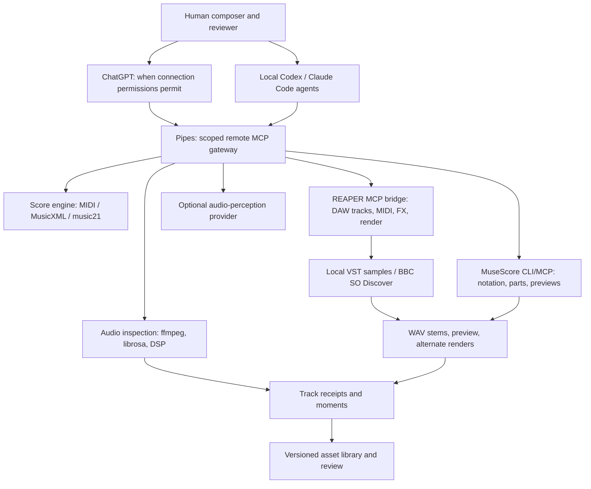

# Pipes — agent-operable musical composition infrastructure

## Purpose

Give local agents and, where product support permits, ChatGPT a governed tool surface for inspecting audio, manipulating **symbolic music** (MIDI/MusicXML), directing a DAW, comparing rendered versions, and preserving the creative lineage of recurring game-score motifs. Integrate existing bridges rather than building another DAW.

**Owner project:** The Long Becoming / Music Systems. **Layer:** cross-estate execution service. **Postures:** listener/analyst, composer, arranger, critic, mastering engineer. **Routing:** task and approvals in IntentTree; reusable prompt/performance stacks in SkillMeat; decisions in MeatyWiki; optional quality telemetry in CCDash. **Scope:** personal creative experiment, not an AOS core product.

## Context and current sample

- Source: `Above the Rowan Canopy - OMG.wav` (user supplied).
- Original format: 3:14.8, PCM 16-bit, stereo 48 kHz (read from media file, 2026-10-09).
- User-favored moments: new intensity around 0:30, micro-moment 1:30–1:45; filmic fiddle/cello response.
- Downsampled digital signal processing indicates elevated 0:30–1:00 intensity relative to first 30 s and high spectral brightness from 1:30–1:45. This **does not identify instruments, the actual melody, or emotional meaning**.
- Predominant pitch-class energy follows a D-major-like collection. This is a **provisional tonal fingerprint**, not a formal key analysis of the composition.
- Preserve original immutable; all clips and transcriptions should have parent hash + timestamps.

## Working architecture

## Integration assessment as of 2026-10-09

| Target | Integration | Verdict |
|---|---|---|
| REAPER | TwelveTake REAPER MCP; or ericjsolis/reaper-mcp | **Use an existing MCP bridge**. Verify installed version and tool surface in a test REAPER project, not a live session. Bridge is local; REAPER must be running. |
| MuseScore Studio | Community MuseScore MCP or MusicXML/MIDI + MuseScore CLI | **Use existing code/CLI** for staff notation and exports. |
| Audio inspection | ffmpeg, soundfile, librosa | **No paid tool or AI required** for metadata, clipping, spectrum, onset and tentative harmony. |
| Symbolic composition | music21, pretty_midi | **Scriptable free libraries**. Standardized output is MIDI + MusicXML, not model prose alone. |
| Realistic orchestral playback | Spitfire BBC Symphony Orchestra Discover | **Free sound library**; instrument availability and DAW routing must be validated after installation. |
| ACE Studio | ACE Bridge 2 (VST/AU) syncs MIDI and audio with DAWs | Useful later, **not a verified public MCP server/API**. Work via a supported DAW bridge or export. No UI scraping as default. |
| Ableton Live | ahujasid/ableton-mcp | Alternative if the user already owns/chooses Ableton; more setup and potentially more cost than REAPER. |
| Suno | UI-supported audio import / export and Cover/Remaster where licensed | No claim of a general official music-creation API. **Don't automate private endpoints or scrape**. Tooling may only prepare/validate local assets for manual import. |
| ChatGPT | Remote MCP app and private Secure MCP Tunnel | As currently documented, individual Pro can connect read/fetch MCP in developer mode but full MCP write is in Business/Enterprise/Edu. Local agents can use stdio read/write where MCP client permits. |

## Interface contracts (proposal, not deployed)

Read-only by default:

- `audio.inspect(asset_id) -> {codec,duration,sample_rate,channels,sha256}`
- `audio.moments(asset_id, start?, end?) -> {rms, onset, pitch_class_histogram, novelty_markers, confidence}`
- `audio.excerpt(asset_id,start,end,format) -> {artifact_id,path}` (safe file creation; never alters source)
- `score.inspect(score_id) -> {parts,tempos,sections,markers,notes}`
- `score.motif.compare(score_a,score_b,transposition_invariant=true) -> {matches,differences}`
- `project.status() -> {connection,DAW,active_project,dirty_state}`

Write (local agents only until account permissions support more):

- `score.motif.create(name,notes,rhythm,meter,version)` -> new immutable score revision
- `score.arrange(score_id, instrument_roles, constraints)` -> preview MusicXML / MIDI, never implicit merge
- `daw.compose_preview(score_revision, instrument_map)` -> isolated scratch project
- `daw.render_preview(project_id,region,format)` -> versioned output + measured LUFS/peak
- `asset.promote(revision, rationale)` -> versioned library asset; explicit human review

For third-party MCP servers, wrap/route existing specific tools rather than implementing redundant DAW actions. Tool names above are the **Pipes API design**, not existing tools.

## Scope, permissions, trust

1. Keep an allowlisted working directory. No arbitrary filesystem reads/writes.
2. Read-only unless a specific task authorizes creation or modification. Use a scratch DAW project and name every undoable edit.
3. Hash the input WAV and timestamp all excerpts; never overwrite original.
4. Separate **measured features**, **model claims**, **human listening observations**, and **canonical symbolic scores**.
5. Use local deterministic audio DSP on Suno files initially. Suno's September 2026 Terms have broad restrictions about using output to power/enable/train other AI models/tools; seek an appropriately authoritative interpretation/permission before submitting these recordings to another AI analysis or transcription model. The technical ability to invoke such a tool does not imply permitted use.
6. Avoid public-facing live DAW access; use local MCP for workstation, private outbound tunnel and authentication where supported; approval before mutating actions.
7. Don't claim audio perception can infer exact orchestration from a dense master; compare extracted parts against human-approved annotations.

## MVP path

### Milestone 0: Rowan recording receipt (completed for this conversation)

- Original file metadata verified.
- Deterministic DSP timeline generated.
- Highlight clips 0:25–1:00 and 1:25–1:52 generated.
- 0:30 and 1:30–1:45 chosen for detailed musical review.

### Milestone 1: Native DAW pipe (next)

- Install REAPER using official evaluation and TwelveTake MCP in a disposable project.
- Confirm live `get_project_summary`, create 3 instrument tracks, add a few MIDI notes, render a WAV, reopen, undo.
- Render an 8–16-bar *freshly composed* Rowan motif, not an asserted transcription of the Suno recording.
- Export MIDI, MusicXML, WAV + stem set, with lineage hashes.

### Milestone 2: Auditable sonic intelligence

- Add score motif registry, reference-aware variants, note/interval comparison, measure-by-measure animation for AGL.
- If terms/rights permit, test per-instrument stem extraction and model-based audio listening/transcription on a separate approved corpus.
- Calibrate note-level confidence and retain corrections.

### Milestone 3: Cross-harness integration

- Local stdio MCP server for local agents.
- Read-only remote MCP gateway through Secure MCP Tunnel for eligible ChatGPT connection.
- Include explicit approval / audit flows before local write actions; do not promise ChatGPT Pro write support if not available.

## Success criteria

- From a single local agent request, open a scratch score and produce an audible original two-instrument cue, preserving score source and audio export.
- Return a compare report identifying which exact notes changed between two versions.
- Audio inspection is bounded by time and confirms file properties without claiming nonexistent fine-grained transcription.
- Human can audition A/B and promote one selected take; other variants remain recoverable.
- Same artifact can be rendered in two instrument libraries and analyzed without losing melody identity.

## Reference links (checked 2026-10-09)

- REAPER official purchase/evaluation: https://www.reaper.fm/purchase.php
- TwelveTake REAPER MCP: https://github.com/TwelveTake-Studios/reaper-mcp
- Alternative REAPER MCP: https://github.com/ericjsolis/reaper-mcp
- MuseScore MCP: https://github.com/strongbeen04/MUSESCORE-MCP
- music21: https://music21.org/music21docs/about/what.html
- Librosa features: https://librosa.org/doc/latest/feature.html
- ACE Bridge 2: https://docs.acestudio.ai/daw-integration/ace-bridge-2
- Free orchestra library: https://www.spitfireaudio.com/pages/discover
- ChatGPT developer mode / full MCP scope: https://help.openai.com/en/articles/12584461-developer-mode-and-mcp-apps-in-chatgpt
- Secure MCP Tunnel: https://developers.openai.com/api/docs/guides/secure-mcp-tunnels
- Suno Terms effective 2026-09-03: https://suno.com/terms/
