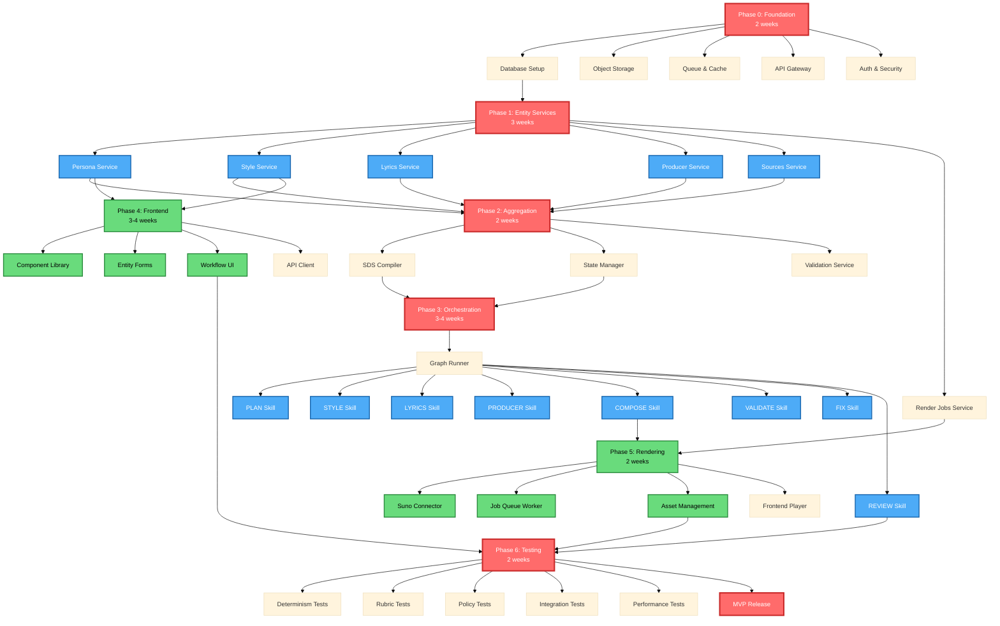

# MeatyMusic AMCS Implementation Roadmap

**Version**: 1.0
**Last Updated**: 2025-11-11
**Status**: Pre-implementation
**Total Duration**: 14-18 weeks (MVP), 10-12 weeks (minimal viable)

## Executive Summary

MeatyMusic AMCS transforms structured creative intent into validated musical artifacts through a deterministic, constraint-driven composition system. Implementation follows 6 phases (0-5) plus testing (6), building from infrastructure foundation through entity services, aggregation, orchestration, frontend, and rendering connectors.

**Critical Path** (10-12 weeks): Phase 0 (Infrastructure) → Phase 1 (Entity Services) → Phase 2 (Aggregation) → Phase 3 (Orchestration) → Phase 6 (Testing & Integration). This path delivers core composition pipeline with CLI interface. Adding Phase 4 (Frontend) and Phase 5 (Rendering) extends to 14-18 weeks for full-featured MVP.

**Parallelization Strategy**: Multiple independent work streams enable 3-4 agent teams working concurrently once Phase 0 completes. Peak parallelism in Phase 1 (5 entity services) and Phase 3 (8 workflow skills).

---

## Phase Overview

| Phase | Name | Duration | Prerequisites | Agents | Deliverables | Critical Path |
|-------|------|----------|---------------|--------|--------------|---------------|
| 0 | Foundation | 2 weeks | None | infra, db, api | Postgres, S3, Redis, FastAPI gateway, auth | ✓ |
| 1 | Entity Services | 3 weeks | Phase 0 | backend, db, api | CRUD endpoints for 6 entities + RLS | ✓ |
| 2 | Aggregation | 2 weeks | Phase 1 | backend, orchestration | SDS compilation, validation, state manager | ✓ |
| 3 | Orchestration | 3-4 weeks | Phase 2 | orchestration, ai-artifacts | 8 workflow skills, graph runner, event stream | ✓ |
| 4 | Frontend | 3-4 weeks | Phase 1 | frontend, ui-ux | React UI, form wizards, real-time updates | - |
| 5 | Rendering | 2 weeks | Phase 3 | backend, integrations | Suno connector, job polling, asset storage | - |
| 6 | Testing | 2 weeks | Phases 3-5 | qa, orchestration | Determinism tests, rubric validation, E2E | ✓ |

**Total**: 14-18 weeks (all phases) | 10-12 weeks (critical path only)

---

## Phase 0: Foundation Infrastructure

**Goal**: Deploy core infrastructure with security, observability, and data persistence ready for entity services.

**Duration**: 2 weeks

### Work Packages

#### WP0.1: Database Setup
**Agent**: `database-architect`
**Tasks**:
- Deploy Postgres 15+ with pgvector extension
- Create database `meatymusic_amcs`
- Configure connection pooling (PgBouncer)
- Set up migration framework (Alembic)
- Define schema structure: `public`, `audit`, `jobs`

**Deliverables**:
- `migrations/versions/001_initial_schema.py`
- Connection strings in `.env.production`
- RLS policies template

#### WP0.2: Object Storage
**Agent**: `devops-engineer`
**Tasks**:
- Configure S3-compatible storage (AWS S3 or MinIO)
- Create buckets: `artifacts`, `renders`, `sources`
- Set lifecycle policies (90-day retention for drafts)
- Configure CORS for frontend uploads
- Generate pre-signed URL service

**Deliverables**:
- Bucket creation scripts: `infra/storage/setup.sh`
- Storage client: `backend/services/storage_client.py`

#### WP0.3: Queue & Cache
**Agent**: `devops-engineer`
**Tasks**:
- Deploy Redis cluster (persistence enabled)
- Configure queues: `render_jobs`, `events`, `fixes`
- Set up pub/sub channels for WebSocket events
- Define TTL policies (session cache: 1h, job status: 24h)

**Deliverables**:
- Redis config: `infra/redis/redis.conf`
- Queue client: `backend/services/queue_client.py`

#### WP0.4: API Gateway
**Agent**: `api-architect`
**Tasks**:
- Initialize FastAPI project structure
- Configure CORS, rate limiting, request validation
- Set up WebSocket endpoint `/ws/events`
- Implement health check `/health`
- Add structured logging (JSON logs to stdout)

**Deliverables**:
- `backend/gateway/main.py`
- `backend/gateway/middleware/`
- `backend/gateway/routes/__init__.py`

#### WP0.5: Auth & Security
**Agent**: `security-engineer`
**Tasks**:
- Implement JWT-based auth (auth0 or custom)
- Define user roles: `user`, `admin`, `service`
- Create RLS policy templates for entities
- Set up API key rotation for MCP servers
- Configure secrets management (AWS Secrets Manager or Vault)

**Deliverables**:
- `backend/auth/jwt_handler.py`
- `backend/auth/rls_policies.sql`
- `.env.template` with secret keys

### Success Criteria
- [ ] Postgres accessible with migrations applied
- [ ] S3 buckets accept PUT/GET with pre-signed URLs
- [ ] Redis pub/sub delivers messages <10ms P95
- [ ] FastAPI `/health` returns 200 with DB connectivity check
- [ ] JWT tokens validate and enforce role-based access

### App State After Phase 0
```
Infrastructure: Postgres (empty schema), S3 (empty buckets), Redis (running)
Gateway: FastAPI skeleton with /health, /auth endpoints
Auth: JWT validation working, RLS policies defined (not applied)
Deployable: Local dev via docker-compose
```

---

## Phase 1: Entity CRUD Services

**Goal**: Implement CRUD APIs for all 6 entities with schema validation, RLS, and audit trails.

**Duration**: 3 weeks

### Work Packages (Parallel)

#### WP1.1: Persona Service
**Agent**: `backend-api-engineer`
**PRD**: `persona.prd.md`
**Tasks**:
- Schema: `personas` table (id, name, bio, vocal_range, influences, tags, user_id)
- CRUD routes: `POST /personas`, `GET /personas`, `GET /personas/{id}`, `PUT /personas/{id}`, `DELETE /personas/{id}`
- RLS: Users see only their personas + public templates
- Validation: Pydantic models from `schemas/persona.schema.json`

**Deliverables**:
- `migrations/versions/002_personas.py`
- `backend/services/personas/crud.py`
- `backend/routes/personas.py`

#### WP1.2: Style Service
**Agent**: `backend-api-engineer`
**PRD**: `style.prd.md`
**Tasks**:
- Schema: `styles` table (id, genre, bpm, key, mood, instrumentation, tags, conflict_matrix_version)
- Tag validation against `taxonomies/music_tags.json`
- Conflict detection using `taxonomies/conflict_matrix.json`
- CRUD routes + conflict check endpoint `/styles/validate-tags`

**Deliverables**:
- `migrations/versions/003_styles.py`
- `backend/services/styles/crud.py`
- `backend/services/styles/tag_validator.py`
- `backend/routes/styles.py`

#### WP1.3: Lyrics Service
**Agent**: `backend-api-engineer`
**PRD**: `lyrics.prd.md`
**Tasks**:
- Schema: `lyrics` table (id, sections[], rhyme_scheme, meter, pov, imagery, citations, profanity_score)
- Section validation: Required fields (type, lines, duration_sec)
- Citation storage: Source hash, chunk_id, relevance_score
- CRUD routes + profanity check endpoint `/lyrics/check-profanity`

**Deliverables**:
- `migrations/versions/004_lyrics.py`
- `backend/services/lyrics/crud.py`
- `backend/services/lyrics/profanity_checker.py`
- `backend/routes/lyrics.py`

#### WP1.4: Producer Notes Service
**Agent**: `backend-api-engineer`
**PRD**: `producer_notes.prd.md`
**Tasks**:
- Schema: `producer_notes` table (id, arrangement, structure, mix_targets, blueprint_ref)
- Blueprint reference validation against `docs/hit_song_blueprint/AI/*.md`
- CRUD routes

**Deliverables**:
- `migrations/versions/005_producer_notes.py`
- `backend/services/producer_notes/crud.py`
- `backend/routes/producer_notes.py`

#### WP1.5: Sources Service
**Agent**: `backend-api-engineer`
**PRD**: `sources.prd.md`
**Tasks**:
- Schema: `sources` table (id, type, uri, chunks[], embeddings, metadata, mcp_scope)
- pgvector integration for embedding storage
- Chunk indexing with content hashes
- CRUD routes + retrieval endpoint `/sources/{id}/retrieve?query=...&top_k=5`

**Deliverables**:
- `migrations/versions/006_sources.py`
- `backend/services/sources/crud.py`
- `backend/services/sources/retrieval.py`
- `backend/routes/sources.py`

#### WP1.6: Render Jobs Service
**Agent**: `backend-api-engineer`
**PRD**: `render_job.prd.md`
**Tasks**:
- Schema: `render_jobs` table (id, engine, prompt, status, job_id, assets[], error_msg, created_at, completed_at)
- Job status tracking: `queued`, `processing`, `completed`, `failed`
- CRUD routes + status polling endpoint `/render_jobs/{id}/status`

**Deliverables**:
- `migrations/versions/007_render_jobs.py`
- `backend/services/render_jobs/crud.py`
- `backend/routes/render_jobs.py`

### Success Criteria
- [ ] All 6 entity CRUD endpoints pass OpenAPI spec validation
- [ ] RLS policies enforce user isolation (test with 2 users)
- [ ] Tag conflict detection rejects `["whisper", "anthemic"]`
- [ ] Profanity checker flags explicit content when `explicit: false`
- [ ] Source retrieval returns deterministic top-k with same query+seed
- [ ] Audit logs capture all CREATE/UPDATE/DELETE operations

### App State After Phase 1
```
Database: 6 entity tables with RLS policies active
API: 6 RESTful services with full CRUD + validation
Storage: Entity specs stored as JSON in `specs/{song_id}/`
Deployable: API + DB via docker-compose
```

---

## Phase 2: SDS Aggregation & State Management

**Goal**: Compile entity specs into Song Design Spec (SDS), validate against schema, and manage workflow state.

**Duration**: 2 weeks

### Work Packages

#### WP2.1: SDS Compiler
**Agent**: `backend-orchestration-engineer`
**PRD**: `sds.prd.md`
**Tasks**:
- Endpoint: `POST /sds/compile` (input: entity IDs, output: SDS JSON)
- Fetch entities via CRUD services
- Merge into single JSON per `schemas/sds.schema.json`
- Validate against blueprint constraints (BPM range, tag conflicts, section count)
- Store compiled SDS in `specs/{song_id}/sds_{version}.json`

**Deliverables**:
- `backend/services/sds/compiler.py`
- `backend/routes/sds.py`
- `schemas/sds.schema.json` (JSON Schema v7)

#### WP2.2: Workflow State Manager
**Agent**: `backend-orchestration-engineer`
**PRD**: `claude_code_orchestration.prd.md`
**Tasks**:
- Schema: `workflow_runs` table (id, song_id, sds_hash, status, current_node, artifacts{}, scores{}, events[], created_at)
- State transitions: `queued` → `running` → `completed|failed`
- Artifact storage: Per-node outputs in `runs/{song_id}/{run_id}/node_{name}.json`
- Event emission: Publish to Redis pub/sub on state changes

**Deliverables**:
- `migrations/versions/008_workflow_runs.py`
- `backend/services/workflow/state_manager.py`
- `backend/routes/workflow.py`

#### WP2.3: Validation Service
**Agent**: `backend-orchestration-engineer`
**PRD**: `blueprint.prd.md`
**Tasks**:
- Endpoint: `POST /validate` (input: SDS, output: validation report)
- Check schema compliance (ajv validation)
- Check blueprint constraints per genre
- Check policy guards (profanity, PII, artist normalization)
- Return scored report: `{valid: bool, errors: [], warnings: [], scores: {}}`

**Deliverables**:
- `backend/services/validation/validator.py`
- `backend/services/validation/policy_guards.py`
- `backend/routes/validation.py`

### Success Criteria
- [ ] SDS compiler merges 6 entities into valid JSON per schema
- [ ] Validation rejects SDS with conflicting tags
- [ ] Validation enforces BPM windows per genre blueprint
- [ ] Workflow state transitions persist and emit events
- [ ] SDS hash reproducibility: Same inputs → same hash

### App State After Phase 2
```
Database: workflow_runs table tracking state
Services: SDS compiler, validator, state manager
Storage: Compiled SDSs in specs/, workflow artifacts in runs/
Deployable: API + orchestration services
```

---

## Phase 3: Workflow Orchestration (Claude Code Skills)

**Goal**: Implement 8 workflow skills as Claude Code artifacts with deterministic logic, retries, and event streaming.

**Duration**: 3-4 weeks

### Work Packages (Parallel after WP3.1)

#### WP3.1: Graph Runner Framework
**Agent**: `ai-artifacts-engineer`
**PRD**: `claude_code_orchestration.prd.md`
**Tasks**:
- CLI tool: `amcs-runner` (Python Click or Node.js Commander)
- Load SDS from `specs/{song_id}/sds.json`
- Execute skill DAG: PLAN → STYLE → LYRICS → PRODUCER → COMPOSE → VALIDATE → (FIX)* → REVIEW
- Retry logic: Max 3 attempts per node with exponential backoff
- Event emission: Start, end, fail, metrics per node
- Store artifacts: `runs/{song_id}/{run_id}/node_{name}.json`

**Deliverables**:
- `.claude/skills/amcs-runner/SKILL.md`
- `.claude/skills/amcs-runner/scripts/runner.js`
- `.claude/skills/amcs-runner/templates/node_output.json`

#### WP3.2: PLAN Skill
**Agent**: `ai-artifacts-engineer`
**PRD**: `claude_code_orchestration.prd.md` (PLAN node spec)
**Tasks**:
- Input: SDS
- Output: Ordered work targets (sections, goals, priorities)
- Seed propagation: Use `sds.seed` or `sds.seed + 1`
- Deterministic section ordering

**Deliverables**:
- `.claude/skills/amcs-plan/SKILL.md`
- `.claude/skills/amcs-plan/scripts/plan.js`

#### WP3.3: STYLE Skill
**Agent**: `ai-artifacts-engineer`
**PRD**: `style.prd.md`, `blueprint.prd.md`
**Tasks**:
- Input: SDS, blueprint
- Output: Style spec (genre, BPM, key, mood, tags)
- Tag sanitization: Remove conflicts per `taxonomies/conflict_matrix.json`
- Limit tags to 8-12 per blueprint guidance
- Seed propagation: `sds.seed + 2`

**Deliverables**:
- `.claude/skills/amcs-style/SKILL.md`
- `.claude/skills/amcs-style/scripts/style.js`
- `.claude/skills/amcs-style/supporting/tag-conflicts.md`

#### WP3.4: LYRICS Skill
**Agent**: `ai-artifacts-engineer`
**PRD**: `lyrics.prd.md`
**Tasks**:
- Input: SDS, style spec, sources
- Output: Lyrics (sections[], rhyme_scheme, citations[])
- Citation hashing: Store source chunk hashes
- Profanity filtering per `sds.constraints.explicit`
- Seed propagation: `sds.seed + 3`

**Deliverables**:
- `.claude/skills/amcs-lyrics/SKILL.md`
- `.claude/skills/amcs-lyrics/scripts/lyrics.js`
- `.claude/skills/amcs-lyrics/supporting/rhyme-schemes.md`

#### WP3.5: PRODUCER Skill
**Agent**: `ai-artifacts-engineer`
**PRD**: `producer_notes.prd.md`
**Tasks**:
- Input: SDS, style spec, lyrics
- Output: Producer notes (arrangement, structure, mix_targets)
- Blueprint alignment: Check against genre-specific guidance
- Seed propagation: `sds.seed + 4`

**Deliverables**:
- `.claude/skills/amcs-producer/SKILL.md`
- `.claude/skills/amcs-producer/scripts/producer.js`

#### WP3.6: COMPOSE Skill
**Agent**: `ai-artifacts-engineer`
**PRD**: `prompt.prd.md`
**Tasks**:
- Input: Style spec, lyrics, producer notes
- Output: Composed prompt (merged artifact with section tags)
- Enforce model limits: Suno 3000 chars, future engines from `limits/{engine}.json`
- Section tag formatting: `[Verse 1]`, `[Chorus]`, `[Bridge]`
- Metadata tags: `[BPM: 120]`, `[Key: C Major]`

**Deliverables**:
- `.claude/skills/amcs-compose/SKILL.md`
- `.claude/skills/amcs-compose/scripts/compose.js`

#### WP3.7: VALIDATE Skill
**Agent**: `ai-artifacts-engineer`
**PRD**: `blueprint.prd.md`
**Tasks**:
- Input: Composed prompt, SDS, rubric
- Output: Validation report with scores
- Metrics: hook_density, singability, rhyme_tightness, section_completeness, profanity_score, total
- Thresholds: Pass if `total >= 0.80` (configurable per genre)
- Guard checks: Length, section count, conflicts, policy compliance

**Deliverables**:
- `.claude/skills/amcs-validate/SKILL.md`
- `.claude/skills/amcs-validate/scripts/validate.js`
- `.claude/skills/amcs-validate/supporting/rubric-weights.md`

#### WP3.8: FIX Skill
**Agent**: `ai-artifacts-engineer`
**PRD**: `claude_code_orchestration.prd.md` (FIX node spec)
**Tasks**:
- Input: Validation report, artifacts
- Output: Targeted diffs (e.g., "add hook repetition", "tighten rhyme scheme")
- Auto-fix playbook:
  - Low hook density → duplicate chorus hooks
  - Weak rhyme → adjust scheme or syllables
  - Tag conflicts → drop lowest-weight tag
- Max 3 iterations
- Loop: FIX → COMPOSE → VALIDATE

**Deliverables**:
- `.claude/skills/amcs-fix/SKILL.md`
- `.claude/skills/amcs-fix/scripts/fix.js`
- `.claude/skills/amcs-fix/supporting/fix-playbook.md`

#### WP3.9: REVIEW Skill
**Agent**: `ai-artifacts-engineer`
**PRD**: `claude_code_orchestration.prd.md` (REVIEW node spec)
**Tasks**:
- Input: All artifacts, scores, events
- Output: Summary JSON with provenance, hashes, final scores
- Persist artifacts to S3: `artifacts/{song_id}/{run_id}/`
- Emit final event: `workflow.completed`

**Deliverables**:
- `.claude/skills/amcs-review/SKILL.md`
- `.claude/skills/amcs-review/scripts/review.js`

### Success Criteria
- [ ] Graph runner executes PLAN → REVIEW without manual intervention
- [ ] Determinism: 10 runs with same SDS+seed produce identical artifacts
- [ ] Event stream delivers all node events via WebSocket
- [ ] FIX loop converges within 3 iterations on test suite
- [ ] Validation pass rate ≥ 95% on 50-song synthetic set
- [ ] All artifacts stored with SHA-256 hashes

### App State After Phase 3
```
Skills: 8 workflow nodes as Claude Code skills in .claude/skills/
CLI: amcs-runner executes graph from SDS input
Storage: Artifacts in runs/, events in Redis
Deployable: CLI tool + API backend
```

---

## Phase 4: Frontend (React Web App)

**Goal**: Build React UI with form wizards, real-time updates, and composition workflow visualization.

**Duration**: 3-4 weeks

### Work Packages (Parallel)

#### WP4.1: Component Library & Design System
**Agent**: `frontend-ui-engineer`
**PRD**: `website_app.prd.md` (Design Tokens section)
**Tasks**:
- Initialize React project (Vite + TypeScript)
- Set up Tailwind CSS with MeatyMusic theme
- Create base components: Button, Input, Select, Card, Modal
- Form components: TextArea, TagInput, RangeSlider
- Layout components: Header, Sidebar, Footer

**Deliverables**:
- `frontend/src/components/ui/`
- `frontend/src/styles/theme.ts`
- Storybook stories for all components

#### WP4.2: Entity Form Wizards
**Agent**: `frontend-form-engineer`
**PRD**: `website_app.prd.md` (Forms section)
**Tasks**:
- Multi-step forms for Persona, Style, Lyrics, Producer Notes, Sources
- Real-time validation against JSON schemas
- Autosave drafts to localStorage
- Progress indicators (step N of M)

**Deliverables**:
- `frontend/src/pages/personas/PersonaForm.tsx`
- `frontend/src/pages/styles/StyleForm.tsx`
- `frontend/src/pages/lyrics/LyricsForm.tsx`
- `frontend/src/pages/producer/ProducerForm.tsx`
- `frontend/src/pages/sources/SourceForm.tsx`

#### WP4.3: Composition Workflow UI
**Agent**: `frontend-workflow-engineer`
**PRD**: `website_app.prd.md` (Workflow section)
**Tasks**:
- SDS compilation wizard: Select entities → preview SDS → submit
- Real-time workflow status display (node progress, events)
- WebSocket integration for live updates
- Artifact viewer: Display style, lyrics, prompt outputs
- Validation report display with scores and warnings

**Deliverables**:
- `frontend/src/pages/workflow/Compose.tsx`
- `frontend/src/pages/workflow/Status.tsx`
- `frontend/src/hooks/useWebSocket.ts`
- `frontend/src/components/workflow/NodeProgress.tsx`

#### WP4.4: API Client & State Management
**Agent**: `frontend-data-engineer`
**Tasks**:
- API client with Axios or Fetch
- React Query for server state management
- JWT token handling and refresh
- Error handling and retry logic
- Optimistic updates for CRUD operations

**Deliverables**:
- `frontend/src/api/client.ts`
- `frontend/src/api/hooks/` (usePersonas, useStyles, etc.)
- `frontend/src/store/auth.ts` (Zustand or Context)

#### WP4.5: Routing & Navigation
**Agent**: `frontend-ui-engineer`
**PRD**: `website_app.prd.md` (Routes section)
**Tasks**:
- React Router setup
- Protected routes with auth guards
- Breadcrumb navigation
- Routes: `/`, `/personas`, `/styles`, `/lyrics`, `/producer`, `/sources`, `/compose`, `/workflows/:id`

**Deliverables**:
- `frontend/src/router.tsx`
- `frontend/src/components/layout/Navigation.tsx`

### Success Criteria
- [ ] All entity forms validate and submit to API
- [ ] Composition wizard compiles SDS and initiates workflow
- [ ] Real-time status updates via WebSocket display in <1s
- [ ] Artifact viewer renders all outputs (style, lyrics, prompt)
- [ ] Mobile responsive (breakpoints: 640px, 768px, 1024px)
- [ ] Lighthouse score ≥ 90 (performance, accessibility)

### App State After Phase 4
```
Frontend: React app with full CRUD + composition UI
API Integration: All entity services + workflow endpoints
Real-time: WebSocket connection for live updates
Deployable: Frontend + backend + DB via docker-compose
```

---

## Phase 5: Rendering Integration

**Goal**: Implement Suno connector with job polling, asset storage, and feature flag control.

**Duration**: 2 weeks

### Work Packages

#### WP5.1: Suno Connector Service
**Agent**: `backend-integrations-engineer`
**PRD**: `render_job.prd.md`, `future_expansions.prd.md` (Suno Integration)
**Tasks**:
- Suno API client: Authentication, request/response handling
- Endpoint: `POST /render` (input: composed_prompt, output: job_id)
- Submit job to Suno with prompt + metadata
- Poll job status: Check every 10s until `completed|failed`
- Download assets (audio files) and store in S3 `renders/`
- Update `render_jobs` table with status, assets, error messages

**Deliverables**:
- `backend/services/rendering/suno_connector.py`
- `backend/routes/render.py`
- `backend/config/rendering.py` (feature flags)

#### WP5.2: Job Queue Worker
**Agent**: `backend-integrations-engineer`
**Tasks**:
- Background worker (Celery or custom) consuming `render_jobs` queue
- Dequeue job → submit to Suno → poll → store assets → update DB
- Retry logic: 3 attempts with exponential backoff
- Error handling: Log failures, emit `render.failed` event

**Deliverables**:
- `backend/workers/render_worker.py`
- `backend/services/queue_client.py` (enqueue/dequeue)

#### WP5.3: Asset Management
**Agent**: `backend-integrations-engineer`
**Tasks**:
- Asset metadata schema: `assets` table (id, render_job_id, type, s3_key, duration_sec, file_size, created_at)
- Pre-signed URL generation for frontend playback
- Asset lifecycle: Retention policies (delete after 90 days)

**Deliverables**:
- `migrations/versions/009_assets.py`
- `backend/services/assets/manager.py`
- `backend/routes/assets.py`

#### WP5.4: Frontend Player Integration
**Agent**: `frontend-media-engineer`
**Tasks**:
- Audio player component (HTML5 or Howler.js)
- Fetch pre-signed URLs from `/assets/{id}/url`
- Playback controls: play, pause, seek, volume
- Display waveform (optional: Wavesurfer.js)

**Deliverables**:
- `frontend/src/components/player/AudioPlayer.tsx`
- `frontend/src/pages/workflows/WorkflowResult.tsx`

### Success Criteria
- [ ] Suno connector submits job and polls until completion
- [ ] Assets stored in S3 with pre-signed URLs accessible
- [ ] Feature flag `render.suno.enabled` gates rendering functionality
- [ ] Frontend player streams audio from S3 without download
- [ ] Job queue processes 10 concurrent render jobs without errors
- [ ] Error handling: Failed renders log error messages and emit events

### App State After Phase 5
```
Backend: Suno connector + job queue worker
Storage: Rendered audio in S3 renders/
Database: render_jobs + assets tables
Frontend: Audio player with playback controls
Deployable: Full MVP with rendering capability
```

---

## Phase 6: Testing & Quality Assurance

**Goal**: Validate determinism, rubric compliance, policy enforcement, and end-to-end workflows.

**Duration**: 2 weeks

### Work Packages

#### WP6.1: Determinism Testing
**Agent**: `qa-automation-engineer`
**Tasks**:
- Test suite: 50 SDSs × 10 runs each with same seed
- Assert: Identical artifacts (byte-level comparison via SHA-256)
- Metrics: Reproducibility rate ≥ 99%
- Test across all workflow nodes

**Deliverables**:
- `tests/determinism/test_reproducibility.py`
- `tests/determinism/fixtures/` (50 SDSs)

#### WP6.2: Rubric Compliance Testing
**Agent**: `qa-automation-engineer`
**PRD**: `blueprint.prd.md`
**Tasks**:
- Test suite: 200 SDSs covering all genres
- Assert: Validation pass rate ≥ 95%
- Metrics: hook_density, singability, rhyme_tightness, section_completeness
- Test auto-fix convergence: ≥ 90% pass within 3 iterations

**Deliverables**:
- `tests/rubric/test_validation.py`
- `tests/rubric/fixtures/` (200 SDSs)

#### WP6.3: Policy Guard Testing
**Agent**: `qa-security-engineer`
**Tasks**:
- Test profanity filtering: Explicit content rejected when `explicit: false`
- Test artist normalization: "style of <living artist>" flagged for public release
- Test PII redaction: Email, phone, address patterns removed
- Test MCP scope enforcement: Access only allowed sources

**Deliverables**:
- `tests/policy/test_profanity.py`
- `tests/policy/test_artist_normalization.py`
- `tests/policy/test_pii_redaction.py`
- `tests/policy/test_mcp_scopes.py`

#### WP6.4: Integration Testing
**Agent**: `qa-automation-engineer`
**Tasks**:
- E2E test: Create entities → compile SDS → run workflow → validate artifacts
- Test WebSocket event stream delivery
- Test API rate limiting and auth enforcement
- Test concurrent workflow execution (10 parallel runs)

**Deliverables**:
- `tests/integration/test_e2e_workflow.py`
- `tests/integration/test_websocket_events.py`
- `tests/integration/test_api_auth.py`

#### WP6.5: Performance Testing
**Agent**: `qa-performance-engineer`
**Tasks**:
- Latency test: Plan→Prompt P95 ≤ 60s (excluding rendering)
- Load test: 100 concurrent users creating entities
- Stress test: 50 concurrent workflow executions
- Memory profiling: Detect leaks in graph runner

**Deliverables**:
- `tests/performance/test_latency.py`
- `tests/performance/test_load.py`
- `tests/performance/locustfile.py` (Locust load tests)

### Success Criteria
- [ ] Determinism: ≥ 99% reproducibility across 500 runs
- [ ] Rubric: ≥ 95% pass rate on 200-song test suite
- [ ] Policy: 100% pass rate on profanity, PII, artist normalization tests
- [ ] Integration: All E2E workflows complete without errors
- [ ] Performance: P95 latency ≤ 60s, handle 100 concurrent users
- [ ] Security: MCP allow-list audit clean (zero violations)

### App State After Phase 6
```
Testing: Comprehensive test suite passing
Validation: Determinism, rubric, policy compliance verified
Deployable: Production-ready MVP
Documentation: Test reports, performance benchmarks
```

---

## Implementation Flow Diagram



**Legend**:
- **Red (Critical Path)**: Phases 0, 1, 2, 3, 6 — Required for minimal viable CLI
- **Blue (Parallel Work)**: Entity services, workflow skills — Can run concurrently
- **Green (Optional for MVP)**: Frontend, rendering — Adds full-featured UI

---

## Agent Assignment Quick Reference

| Agent | Phases | Work Packages | Key Deliverables |
|-------|--------|---------------|------------------|
| `infra-engineer` | 0 | WP0.2, WP0.3 | S3 buckets, Redis, docker-compose |
| `database-architect` | 0, 1 | WP0.1, all WP1.x | Postgres schema, migrations, RLS |
| `api-architect` | 0, 1 | WP0.4, all WP1.x | FastAPI gateway, CRUD routes |
| `security-engineer` | 0, 6 | WP0.5, WP6.3 | Auth, RLS policies, policy tests |
| `backend-api-engineer` | 1 | WP1.1-WP1.6 | 6 entity CRUD services |
| `backend-orchestration-engineer` | 2 | WP2.1-WP2.3 | SDS compiler, state manager, validator |
| `ai-artifacts-engineer` | 3 | WP3.1-WP3.9 | Graph runner, 8 workflow skills |
| `frontend-ui-engineer` | 4 | WP4.1, WP4.5 | Component library, routing |
| `frontend-form-engineer` | 4 | WP4.2 | Entity form wizards |
| `frontend-workflow-engineer` | 4 | WP4.3 | Composition UI, WebSocket integration |
| `frontend-data-engineer` | 4 | WP4.4 | API client, React Query, state mgmt |
| `frontend-media-engineer` | 5 | WP5.4 | Audio player component |
| `backend-integrations-engineer` | 5 | WP5.1-WP5.3 | Suno connector, job worker, asset mgmt |
| `qa-automation-engineer` | 6 | WP6.1, WP6.2, WP6.4 | Determinism, rubric, E2E tests |
| `qa-security-engineer` | 6 | WP6.3 | Policy guard tests |
| `qa-performance-engineer` | 6 | WP6.5 | Latency, load, stress tests |

---

## Parallel Work Opportunities

### Week 1-2 (Phase 0)
- **Team A** (infra-engineer): Storage + Queue
- **Team B** (database-architect): Database + Migrations
- **Team C** (api-architect): API Gateway
- **Team D** (security-engineer): Auth + RLS policies

### Week 3-5 (Phase 1)
- **Team A** (backend-api-engineer): Persona + Style services
- **Team B** (backend-api-engineer): Lyrics + Producer services
- **Team C** (backend-api-engineer): Sources + Render Jobs services
- **Team D** (frontend-ui-engineer): Component library (parallel start for Phase 4)

### Week 6-7 (Phase 2)
- **Team A** (backend-orchestration-engineer): SDS Compiler + State Manager
- **Team B** (backend-orchestration-engineer): Validation Service
- **Team C** (frontend-form-engineer): Entity forms (parallel Phase 4 work)

### Week 8-11 (Phase 3)
- **Team A** (ai-artifacts-engineer): Graph Runner + PLAN + STYLE skills
- **Team B** (ai-artifacts-engineer): LYRICS + PRODUCER + COMPOSE skills
- **Team C** (ai-artifacts-engineer): VALIDATE + FIX + REVIEW skills
- **Team D** (frontend-workflow-engineer): Workflow UI (parallel Phase 4 work)

### Week 12-13 (Phase 5)
- **Team A** (backend-integrations-engineer): Suno Connector + Job Worker
- **Team B** (backend-integrations-engineer): Asset Management
- **Team C** (frontend-media-engineer): Audio Player

### Week 14-15 (Phase 6)
- **Team A** (qa-automation-engineer): Determinism + Rubric tests
- **Team B** (qa-security-engineer): Policy tests
- **Team C** (qa-performance-engineer): Performance tests
- **Team D** (qa-automation-engineer): Integration tests

---

## Risk Mitigation

### High-Risk Areas
- **Determinism**: Seed propagation bugs → **Mitigation**: Unit tests per skill, reproducibility CI check
- **Rubric Tuning**: Scoring thresholds too strict → **Mitigation**: A/B test thresholds, collect feedback
- **Suno API Changes**: Breaking changes to connector → **Mitigation**: Version pinning, connector abstraction layer
- **Performance**: Workflow latency >60s → **Mitigation**: Profile early, optimize retrieval, cache blueprints
- **Scope Creep**: Frontend features delay critical path → **Mitigation**: Defer Phase 4 to post-MVP if needed

### Dependency Management
- **External APIs**: Suno downtime → **Mitigation**: Feature flag `render.suno.enabled`, queue retry logic
- **Database Migrations**: Schema changes break existing data → **Mitigation**: Reversible migrations, staging tests
- **Skill Changes**: Updates break determinism → **Mitigation**: Version skills, lock skill hashes in run metadata

### Testing Gaps
- **Edge Cases**: Unusual SDS inputs (e.g., 20 sections) → **Mitigation**: Synthetic edge case test suite
- **Concurrent Workflows**: Race conditions in state manager → **Mitigation**: Isolation tests, transaction locking
- **Long-running Jobs**: Render jobs timeout → **Mitigation**: Timeout config, graceful failure handling

---

## Next Actions (Week 1 Start)

### Immediate Tasks (Day 1-3)
1. **Provision Infrastructure** (infra-engineer)
   - [ ] Deploy Postgres instance (RDS or local docker)
   - [ ] Create S3 buckets: `artifacts`, `renders`, `sources`
   - [ ] Deploy Redis instance
   - [ ] Create `.env.production` with connection strings

2. **Database Setup** (database-architect)
   - [ ] Initialize Alembic: `alembic init migrations`
   - [ ] Create initial migration: `migrations/versions/001_initial_schema.py`
   - [ ] Define base schema structure: `public`, `audit`, `jobs`
   - [ ] Apply migrations: `alembic upgrade head`

3. **API Gateway Skeleton** (api-architect)
   - [ ] Initialize FastAPI project: `fastapi-starter backend/gateway`
   - [ ] Configure CORS, rate limiting, logging middleware
   - [ ] Implement `/health` endpoint with DB connectivity check
   - [ ] Set up WebSocket endpoint `/ws/events`

4. **Auth Framework** (security-engineer)
   - [ ] Choose auth provider (auth0 or custom JWT)
   - [ ] Implement JWT validation middleware
   - [ ] Create RLS policy templates: `backend/auth/rls_policies.sql`
   - [ ] Document secret management setup

### Week 1 Goals
- [ ] Infrastructure deployed and accessible
- [ ] Database migrations framework operational
- [ ] API gateway serving `/health` with 200 status
- [ ] Auth middleware validates JWT tokens
- [ ] Docker-compose configuration running full stack locally

### Week 2 Goals
- [ ] S3 storage client functional (PUT/GET with pre-signed URLs)
- [ ] Redis pub/sub delivering events to WebSocket clients
- [ ] RLS policies defined (not yet applied)
- [ ] API rate limiting enforced (100 req/min per user)
- [ ] Structured logging outputting JSON to stdout

### Pre-Phase 1 Checklist
- [ ] Postgres accessible, migrations applied
- [ ] S3 buckets accept uploads, lifecycle policies active
- [ ] Redis pub/sub tested with mock events
- [ ] FastAPI gateway passes health checks
- [ ] JWT auth validates tokens, enforces role-based access
- [ ] Docker-compose runs locally without errors
- [ ] `.env.template` documented for all secrets

---

## Success Metrics Summary

### Phase Completion Gates
- **Phase 0**: Infrastructure health checks pass, docker-compose runs
- **Phase 1**: 6 entity CRUD endpoints functional, RLS enforced
- **Phase 2**: SDS compiler validates against schema, state transitions persist
- **Phase 3**: Graph runner executes full workflow, determinism verified
- **Phase 4**: Frontend compiles, API integration functional, WebSocket connected
- **Phase 5**: Suno connector submits jobs, assets stored in S3
- **Phase 6**: All test suites pass, metrics meet acceptance gates

### MVP Acceptance Gates
- **Gate A**: Rubric pass ≥ 95% on 200-song test suite
- **Gate B**: Determinism ≥ 99% reproducibility (500 runs)
- **Gate C**: Security audit clean (MCP allow-list, RLS, auth)
- **Gate D**: Latency P95 ≤ 60s (Plan→Prompt, excluding render)
- **Gate E**: E2E workflow success rate ≥ 98% (1000 runs)

### Performance Targets
| Metric | Target | Phase |
|--------|--------|-------|
| Plan→Prompt Latency | P95 ≤ 60s | 3, 6 |
| Rubric Pass Rate | ≥ 95% | 3, 6 |
| Reproducibility | ≥ 99% | 3, 6 |
| Concurrent Users | 100 | 6 |
| Concurrent Workflows | 50 | 6 |
| WebSocket Event Delivery | P95 ≤ 1s | 4, 6 |
| API Response Time | P95 ≤ 200ms | 1, 6 |

---

## Revision History

| Version | Date | Changes | Author |
|---------|------|---------|--------|
| 1.0 | 2025-11-11 | Initial roadmap | AI Artifacts Engineer |

---

**Document Owner**: AI Artifacts Engineer
**Primary Consumers**: All agent teams, orchestration system
**Update Frequency**: Weekly during active implementation
**Related Docs**: `docs/amcs-overview.md`, all PRDs in `docs/project_plans/PRDs/`
